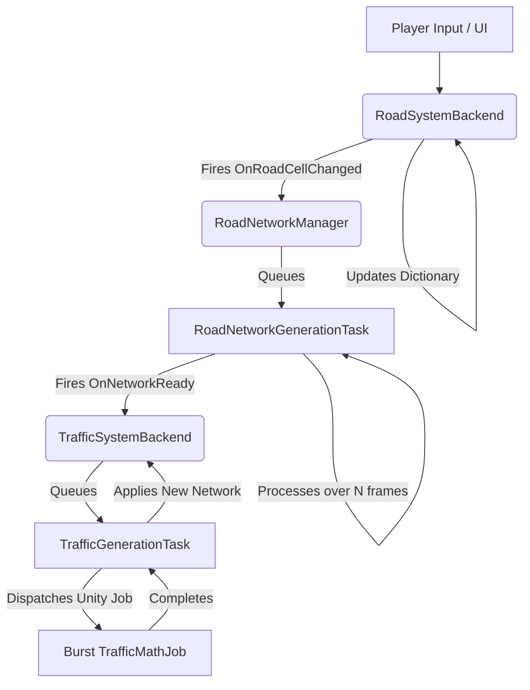

# MiniColonies Architecture & Context Guide

Welcome to the MiniColonies architecture guide. This document provides core context about the project's design philosophy, serving as a reference for developers and AI agents working on the codebase.

## The Core Principle: Performance through Decoupling
The primary goal of this architecture is to execute heavy city-building logic (like road generation, traffic routing, and network mapping) **asynchronously** without causing frame drops on the main thread. To achieve massive scalability, the codebase enforces a strict decoupled architecture:
- Data is separated from logic.
- Heavy logic is time-sliced over multiple frames.
- Systems communicate via Events rather than direct method calls.

## 1. The Task System (`SimulationTaskManager`)

The heart of this decoupled architecture is the `SimulationTaskManager`. It prevents frame drops by time-slicing heavy operations.

### `ISimulationTask` Interface
Every heavy operation MUST be converted into an object that implements `ISimulationTask`:
```csharp
public interface ISimulationTask
{
    bool Process(Stopwatch timer, float maxMillisecondsPerFrame);
}
```
- **Return `true`**: The task is completely finished and can be removed from the queue.
- **Return `false`**: The task needs more time. It has yielded execution so the frame can render, and it will be resumed next frame.

### How the Manager Works
- **Time Budget**: The manager has a `maxMillisecondsPerFrame` (typically 5ms).
- **Execution**: In `Update()`, it peeks at the queue and calls `Process()` on the active task. If `Process()` returns `false` or the time budget is exceeded, it stops executing and yields control back to Unity to render the frame.
- **Unity Jobs**: It also tracks native `JobHandle`s and cleans them up in `LateUpdate()`.

---

## 2. System Backends (Data Layers)

Backends act as the authoritative state for the game. They hold simple data structures and trigger events when data changes, which downstream systems listen to in order to queue simulation tasks.

### `RoadSystemBackend`
- **Data**: A `Dictionary<Vector2Int, RoadCell>`.
- **Purpose**: Manages the grid placement of roads, connections (8-way bitmask), and the temporary "Preview Mode" for when the player is dragging roads but hasn't committed them.
- **Events**: Triggers `OnRoadCellChanged` and `OnChunksDirty` when the grid is mutated.

### `BuildingSystemBackend`
- **Data**: A `Dictionary<Vector2Int, Building>` mapping grid cells to building references.
- **Purpose**: Handles building footprints, demolition logic, and tracks active buildings.

### `TrafficSystemBackend`
- **Data**: A graph of `TrafficNode` and `TrafficEdge`.
- **Purpose**: Provides spatial queries (e.g., `GetClosestLane`) and visualizes the traffic network logic (waypoints, intersections).
- **Workflow**: Listens to the `RoadNetworkManager.OnNetworkReady` event. When the road logic finishes, it queues a `TrafficGenerationTask`.

---

## 3. Asynchronous Tasks

Tasks contain state machines to track their progress across multiple frames. Here are the major ones:

### `RoadNetworkGenerationTask`
- **Purpose**: Group physical road cells into logical "Networks" and evaluate building connectivity.
- **Execution Flow**:
  1. Identifies and tears down old networks touched by modified cells.
  2. Uses Breadth-First Search (BFS) to rebuild new networks. *Yields if the BFS takes too long.*
  3. Reevaluates building ports to verify if they are successfully connected to a valid entry and exit network.

### `TrafficGenerationTask`
- **Purpose**: Generates physical traffic lanes, Bezier curves for intersections, and route mapping.
- **Execution Flow**:
  1. Gathers road segments and dispatches a heavily parallelized **Burst Compiled Unity Job** (`TrafficMathJob`) to generate waypoints.
  2. Waits for the `JobHandle` to complete over multiple frames without blocking.
  3. Builds the node/edge graph from the generated waypoints, mapping straightaways and generating intersection U-turns, left, and right turns based on signed angles.
  4. Flushes the new graph to the `TrafficSystemBackend`.

---

## Data Flow Diagram



## Best Practices for Agents

1. **Never block the main thread**: If a calculation loops over the entire grid or all buildings, it must be put into an `ISimulationTask`.
2. **Pre-allocate Memory**: In your tasks, pre-allocate generic collections (`List`, `HashSet`) as class fields and `.Clear()` them to reuse memory. Avoid creating `new List<T>()` inside the `Process()` loop to prevent GC spikes.
3. **Use the Time Budget**: Check `timer.ElapsedMilliseconds >= maxMillisecondsPerFrame` inside your loops. If true, return `false` to yield.
4. **Data Isolation**: Backends shouldn't call heavy calculation methods on each other. Backends fire events; Managers listen to events and queue Tasks; Tasks read from Backends and write back to them when finished.
